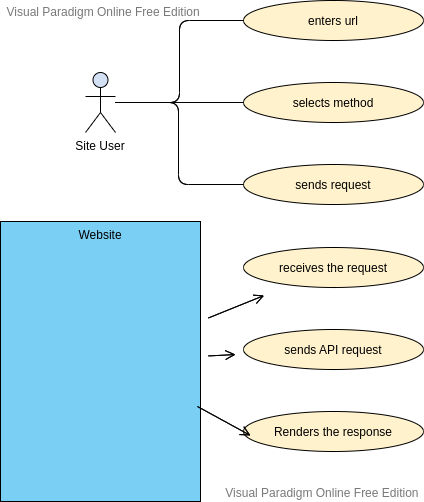

# resty
this is a clone app to postman where user can chose the method and send requests, the app therefore will render the response from the requested API. 

UML:

Netlify link: https://incomparable-concha-b02275.netlify.app/